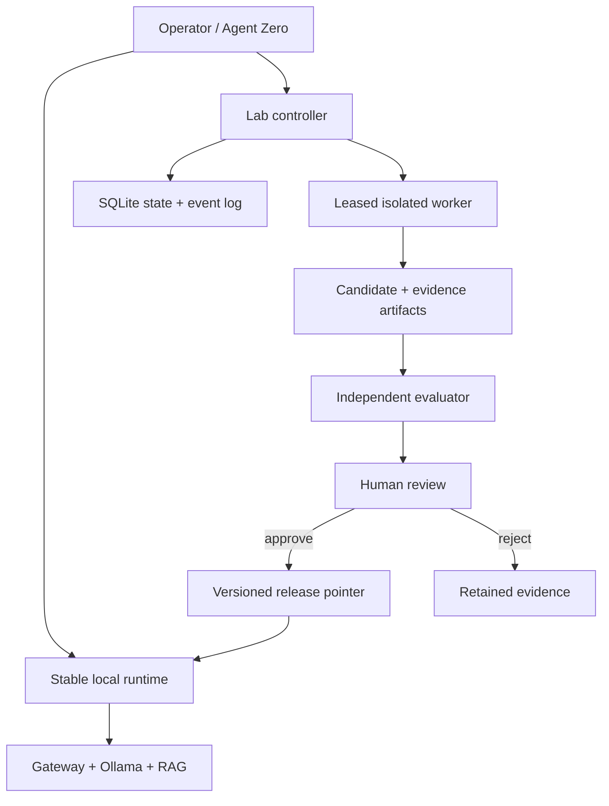
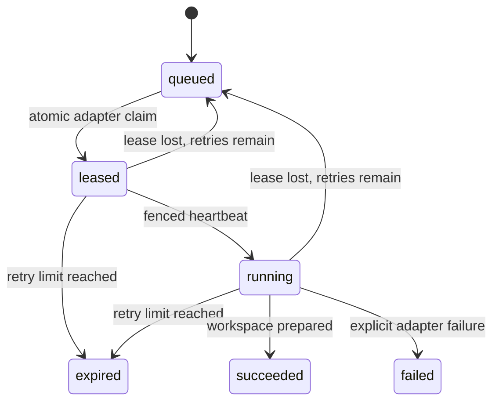
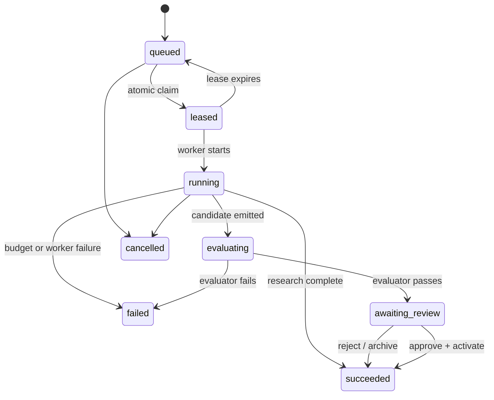

# Local AI Lab Controller v0.1

**Status:** phases 1 and 2 are implemented. `lab_controller/` is a loopback-only
FastAPI service that applies SQLite migrations, persists strict and idempotent
`lab.job/v1` submissions, writes an append-only event log, and exposes status,
list, and detail APIs. It now also has a pull-based lease scheduler, fenced
heartbeats, expiry recovery, a token-protected worker API, and exactly one
`repo-ops` adapter. That adapter creates a disposable code-patch workspace and
then stops. Artifact storage, candidate creation, evaluator runs, releases, and
promotion remain later v0.1 work.

## Goal

Operate a local AI lab that can work for long periods without making the normal
Agent Zero experience unreliable or unsafe. The stable runtime must stay usable
while experiments run in separate, budgeted environments. Improvements are
useful only after they are independently evaluated, explicitly approved, and
reversibly promoted.

v0.1 permits candidates for:

- Agent Zero prompts, policies, skills, and tool routing;
- gateway quality profiles and model-routing policy;
- RAG chunking, retrieval, and reranking configuration; and
- a repository patch produced inside `repo-ops`.

v0.1 does not perform base-model training, modify weights, grant a worker source
or deployment access, publish code, change credentials, or automatically promote
or restart the active runtime. “Self-improvement” means an evidence-based
candidate pipeline, not unrestricted self-modification.

## Architecture boundary



The gateway, Ollama, Agent Zero, Qdrant, and the active configuration form the
**stable runtime**. The controller, workers, evaluator, artifact store, and
release records form the **experimental plane**. The only bridge back is an
atomic release-pointer change made after human approval. Existing `repo-ops`
implements much of the worker isolation; its JSONL records and archives become
inputs and artifacts, not the controller's authoritative state.

## Components and responsibilities

| Component | Responsibility | Must not do |
|---|---|---|
| Controller API + scheduler | Validate jobs, persist state, atomically allocate/reap leases, and fence worker updates | Run arbitrary commands, enforce future execution budgets, evaluate, or decide a promotion |
| SQLite | Durable source of truth for jobs, worker registrations, attempts, and append-only events | Store prompts, secrets, source trees, model outputs, or large blobs |
| Worker adapter | Claim one lease, create an isolated workspace, heartbeat, and report a bounded completion summary | Invoke a model, change a workspace, run checks, write the active checkout, use Docker control, or receive production credentials |
| Evaluator | Run a pinned suite against baseline and candidate, calculate gates, write a verified result | Reuse the candidate's self-report as acceptance evidence |
| Artifact store | Hold immutable manifests, diffs, logs, reports, and redacted evidence keyed by SHA-256 | Be a mutable working directory or credential store |
| Promotion operator | Inspect evidence, approve/reject, atomically update a versioned release pointer, retain rollback | Push, deploy, or restart automatically in v0.1 |

The controller is a local-only service. Manual startup accepts only loopback bind
hosts. Its optional Compose overlay publishes the controller only to host
loopback and connects the adapter through a separate Docker `internal` network.
The worker API requires a non-empty `CONTROLLER_WORKER_TOKEN`; it is not exposed
through Tailscale. Agent Zero must never call an approval endpoint on its own
behalf.

## Implemented controller and scheduler

The service can start manually for development:

```bash
uvicorn lab_controller.main:app --host 127.0.0.1 --port 8091
```

For an isolated local adapter, set a long random `CONTROLLER_WORKER_TOKEN` in
`.env`, then explicitly start the optional overlay (it is not part of the
installer):

```bash
docker compose -f compose.lab-controller.yaml up -d --build
```

The overlay has two services. `lab-controller` has no source mount and publishes
only `127.0.0.1:8091`; `repo-ops-lab-worker` has no port, Docker socket,
production credential, archive mount, or default Compose network. Its sole
secret is the controller worker token. It can reach only the controller over an
internal network, reads `/source` read-only, and writes only its own named
`/workspaces` volume. `network: none` in a job means no external or workload
network access; the private controller heartbeat is the sole control-plane
exception.

Startup applies all ordered SQLite migrations before accepting requests. Every
accepted job begins in `queued`. The general job API remains small, while the
worker-only endpoints are authenticated by the token:

| Endpoint | Current behavior |
|---|---|
| `POST /v1/lab/jobs` | Validate and persist a `lab.job/v1` job; returns `201`, or `200` for an identical idempotent replay. A different request using the same key returns `409`. |
| `GET /v1/lab/jobs` | List job summaries, optionally filtered by state. No mutation is available. |
| `GET /v1/lab/jobs/{job_id}` | Return the validated job spec, append-only event summary, and attempt history. |
| `GET /v1/lab/status` and `GET /health` | Report schema version, scheduler capability, job counts, and worker counts. Promotion remains explicitly `not_implemented`. |
| `POST /v1/lab/workers/register` | Token-protected registration or refresh for the one `repo_ops` worker class. |
| `POST /v1/lab/worker-claims/next` | Token-protected pull claim for one compatible queued workspace-preparation job. |
| `POST /v1/lab/attempts/{id}/heartbeat` | Token- and fence-protected renewal that moves a claimed attempt to `running`. |
| `POST /v1/lab/attempts/{id}/complete` | Token- and fence-protected bounded completion report. It can mark only that attempt/job succeeded or failed. |

The service accepts only loopback `CONTROLLER_HOST` values for manual startup.
It still has no cancellation, approval, reload, deployment, or promotion route,
so a persisted job or a worker completion cannot change the active runtime.

## Job contract

The controller accepts a small versioned JSON document. Large inputs, patches,
datasets, transcripts, and reports are passed by immutable `artifact_ref`, never
embedded in SQLite or copied into a job body. Client input is validated before it
is stored; unknown fields are rejected in v0.1.

```json
{
  "schema_version": "lab.job/v1",
  "idempotency_key": "repo-ops:task-2026-08-16:revision-1",
  "kind": "candidate_build",
  "priority": 50,
  "parent_job_id": null,
  "baseline_release": "release-0007",
  "input_artifacts": ["sha256:aaaaaaaaaaaaaaaaaaaaaaaaaaaaaaaaaaaaaaaaaaaaaaaaaaaaaaaaaaaaaaaa"],
  "candidate": {
    "type": "policy",
    "target": "agent-zero/research-profile",
    "allowed_changes": ["system_prompt", "stage_token_limits"],
    "base_revision": "git:56aa50d364b6dc33a1d3a3196033c38f660e3266"
  },
  "isolation": {
    "worker_class": "repo_ops",
    "network": "none",
    "source_access": "read_only",
    "credential_profile": "none"
  },
  "budget": {
    "wall_seconds": 14400,
    "cpu_seconds": 7200,
    "gpu_seconds": 3600,
    "max_memory_mib": 16384,
    "max_disk_mib": 20480,
    "max_model_calls": 30,
    "max_attempts": 2
  },
  "evaluation": {
    "suite_id": "policy-private-regression",
    "suite_revision": "2026-08-16.1",
    "baseline_required": true,
    "repeat_count": 3
  },
  "review": {"required": true},
  "labels": {"project": "local-ai-api", "risk": "medium"}
}
```

`kind` is one of `research`, `candidate_build`, `candidate_evaluate`, or
`promotion_verify`. `promotion_verify` can assemble a decision packet, but
cannot activate it. Candidate `type` is one of `policy`, `prompt`, `skill`,
`model_routing`, `rag_config`, or `code_patch`; the target and allowed-change
set must be allow-listed by the controller configuration. A `research` job may
write a redacted report but cannot produce a promotable release.

The implemented contract rejects unknown fields and requires a 64-hex
`sha256:` artifact reference. A candidate may request at most two change fields,
and the controller checks both its target namespace and fields against local
allowlists. `candidate_build` requires a `candidate` and an `evaluation`;
`candidate_evaluate` requires a `candidate_id` and an `evaluation`;
`promotion_verify` requires a `candidate_id`. The latter
two job kinds can be recorded now but cannot run until later candidate and
evaluator phases are added. The phase-2 adapter claims only a `candidate_build`
whose candidate is `code_patch`, whose only allowed change is
`patch_manifest`, and whose isolation is `repo_ops` + read-only source + no
credentials + `network: none`. All other valid jobs stay queued. Research jobs
are evidence-only and must set
`review.required` to `false`.

The idempotency key is unique for the job's useful lifetime. Retrying a request
with the same key returns the existing job; changing the intended work requires
a new key. `baseline_release`, suite revision, worker image digest, and input
artifact hashes are captured before execution so a result is reproducible.

## SQLite state model

Migration 1 implements `schema_migrations`, `jobs`, and append-only `events`.
Migration 2 adds `workers` (`ready`, `busy`, or `offline`) and `job_attempts`.
The controller uses one short `BEGIN IMMEDIATE` transaction to claim/reap work,
increments `jobs.attempt_count`, and gives each job a monotonically increasing
`fence_token`. A stale worker therefore cannot extend or complete an attempt
once it is lost or superseded.

Artifacts, candidates, evaluation runs, releases, and attempt-to-artifact links
in the SQL below remain the locked v0.1 data-model target; they do **not** exist
in the current migration. Likewise, current `events` refer to a job and record
attempt identifiers in bounded JSON payloads rather than via an `attempt_id`
column. This distinction prevents the current workspace-preparation completion
from being mistaken for a candidate or release record.

SQLite is the control-plane source of truth, stored on a local durable volume.
Use one writer connection at a time, `PRAGMA journal_mode=WAL`,
`PRAGMA foreign_keys=ON`, `busy_timeout=5000`, and short transactions. Store UTC
RFC 3339 timestamps as text. JSON columns are validated application JSON; they
are not queried for authorization decisions.

```sql
CREATE TABLE jobs (
  id TEXT PRIMARY KEY,
  idempotency_key TEXT NOT NULL UNIQUE,
  kind TEXT NOT NULL CHECK (kind IN
    ('research','candidate_build','candidate_evaluate','promotion_verify')),
  state TEXT NOT NULL CHECK (state IN
    ('queued','leased','running','evaluating','awaiting_review',
     'succeeded','failed','cancelled','expired')),
  priority INTEGER NOT NULL DEFAULT 50 CHECK (priority BETWEEN 0 AND 100),
  spec_json TEXT NOT NULL,
  baseline_release_id TEXT REFERENCES releases(id),
  parent_job_id TEXT REFERENCES jobs(id),
  max_attempts INTEGER NOT NULL CHECK (max_attempts BETWEEN 1 AND 3),
  attempt_count INTEGER NOT NULL DEFAULT 0,
  next_run_at TEXT NOT NULL,
  deadline_at TEXT,
  created_at TEXT NOT NULL,
  updated_at TEXT NOT NULL
);

CREATE TABLE workers (
  id TEXT PRIMARY KEY,
  worker_class TEXT NOT NULL,
  image_digest TEXT NOT NULL,
  capability_json TEXT NOT NULL,
  state TEXT NOT NULL CHECK (state IN ('ready','busy','draining','offline')),
  last_heartbeat_at TEXT NOT NULL,
  created_at TEXT NOT NULL
);

CREATE TABLE job_attempts (
  id TEXT PRIMARY KEY,
  job_id TEXT NOT NULL REFERENCES jobs(id),
  attempt_number INTEGER NOT NULL,
  worker_id TEXT NOT NULL REFERENCES workers(id),
  state TEXT NOT NULL CHECK (state IN
    ('leased','running','finished','failed','lost','cancelled')),
  fence_token INTEGER NOT NULL,
  lease_expires_at TEXT NOT NULL,
  started_at TEXT,
  finished_at TEXT,
  exit_class TEXT,
  summary_json TEXT,
  UNIQUE (job_id, attempt_number),
  UNIQUE (job_id, fence_token)
);

CREATE TABLE artifacts (
  id TEXT PRIMARY KEY,
  sha256 TEXT NOT NULL UNIQUE,
  kind TEXT NOT NULL,
  uri TEXT NOT NULL,
  bytes INTEGER NOT NULL CHECK (bytes >= 0),
  redaction_level TEXT NOT NULL CHECK (redaction_level IN ('public','private','restricted')),
  created_at TEXT NOT NULL,
  expires_at TEXT
);

CREATE TABLE attempt_artifacts (
  attempt_id TEXT NOT NULL REFERENCES job_attempts(id),
  artifact_id TEXT NOT NULL REFERENCES artifacts(id),
  role TEXT NOT NULL,
  PRIMARY KEY (attempt_id, artifact_id, role)
);

CREATE TABLE candidates (
  id TEXT PRIMARY KEY,
  job_id TEXT NOT NULL REFERENCES jobs(id),
  type TEXT NOT NULL CHECK (type IN
    ('policy','prompt','skill','model_routing','rag_config','code_patch')),
  target TEXT NOT NULL,
  state TEXT NOT NULL CHECK (state IN
    ('draft','queued_eval','evaluating','rejected','approved','staged','promoted','rolled_back')),
  base_ref TEXT NOT NULL,
  manifest_artifact_id TEXT NOT NULL REFERENCES artifacts(id),
  created_at TEXT NOT NULL,
  updated_at TEXT NOT NULL
);

CREATE TABLE evaluation_runs (
  id TEXT PRIMARY KEY,
  candidate_id TEXT NOT NULL REFERENCES candidates(id),
  suite_id TEXT NOT NULL,
  suite_revision TEXT NOT NULL,
  environment_digest TEXT NOT NULL,
  baseline_release_id TEXT NOT NULL REFERENCES releases(id),
  result_artifact_id TEXT NOT NULL REFERENCES artifacts(id),
  verdict TEXT NOT NULL CHECK (verdict IN ('pass','fail','inconclusive')),
  created_at TEXT NOT NULL
);

CREATE TABLE releases (
  id TEXT PRIMARY KEY,
  target TEXT NOT NULL,
  state TEXT NOT NULL CHECK (state IN ('staged','active','rolled_back','retired')),
  manifest_artifact_id TEXT NOT NULL REFERENCES artifacts(id),
  previous_release_id TEXT REFERENCES releases(id),
  approved_by TEXT NOT NULL,
  approved_at TEXT NOT NULL,
  activated_at TEXT
);

CREATE UNIQUE INDEX one_active_release_per_target
  ON releases(target) WHERE state = 'active';

CREATE TABLE events (
  id INTEGER PRIMARY KEY AUTOINCREMENT,
  job_id TEXT REFERENCES jobs(id),
  attempt_id TEXT REFERENCES job_attempts(id),
  event_type TEXT NOT NULL,
  payload_json TEXT NOT NULL,
  created_at TEXT NOT NULL
);

CREATE INDEX jobs_runnable ON jobs(state, next_run_at, priority DESC);
CREATE INDEX attempts_lease ON job_attempts(state, lease_expires_at);
CREATE INDEX events_job ON events(job_id, id);
CREATE INDEX evaluations_candidate ON evaluation_runs(candidate_id, created_at);
```

Migrations are append-only and applied before the controller starts accepting
jobs. The partial unique active-release index means only one active release can
exist for one target. If the deployed SQLite version cannot support it, enforce
the same invariant in a transaction and add a startup integrity check.

Artifacts are content-addressed outside SQLite, for example below a controller
data root as `sha256/<first-two>/<hash>`. The manifest records every input,
patch, report, log digest, check result, and evaluation result needed to review
or roll back a candidate. Redact prompts, raw model responses, secrets, headers,
and source copies according to existing repo-ops and agent-learning policy.

## Current job and attempt lifecycle

The implemented scheduler is pull-based: the adapter asks for work; the
controller decides whether there is one compatible queued job. It has no
in-memory queue and no timer that launches commands. A completed phase-2 job
means only that `repo-ops` created a disposable workspace at the pinned base
revision—not that any code changed, evaluation passed, or a candidate exists.



## Target job and candidate lifecycle



The job state is deliberately separate from the candidate state. A rejected
candidate usually makes the job successfully complete: the lab learned a result
and retained its evidence. Candidate transitions are:

```text
draft -> queued_eval -> evaluating -> rejected
                                      \-> approved -> staged -> promoted
                                                          \-> rolled_back
```

Only the evaluator may move a candidate to `approved`; only the promotion
operator may move it from `staged` to `promoted` or `rolled_back`. An approved
candidate expires rather than promoting automatically if its baseline, suite,
or environment becomes stale.

## Worker lifecycle and recovery

1. The `repo-ops-lab-worker` registers with the token, then pulls for work. The
   controller considers only due `queued` `candidate_build` jobs compatible with
   its one `workspace_prepare` capability. A busy worker cannot hold two claims.
2. Claim runs inside `BEGIN IMMEDIATE`: increment `attempt_count`, allocate the
   next `fence_token`, insert a `leased` attempt, set the job `leased`, set the
   worker `busy`, and issue a 60-second lease by default. Only the recorded
   worker ID and current fence token can update that attempt.
3. The adapter immediately heartbeats, changing the attempt to `running`, then
   renews it every 10 seconds by default. It creates a new repo-ops branch from
   the job's declared base SHA. The source mount is read-only; no model,
   workspace-edit, check, commit, merge, push, Docker, or credential operation
   is invoked in this phase.
4. On success it reports a bounded summary (`task_id`, branch, base revision,
   and isolation labels), never an absolute workspace path. Completion marks
   the preparation job `succeeded` and the worker `ready`. On an explicit error,
   it records `policy_denied` or `infra_error` and marks the job `failed`.
5. The controller reaper runs at `CONTROLLER_SCHEDULER_INTERVAL_SECONDS` (five
   seconds by default). A missed lease becomes `lost`; it requeues the job only
   while `attempt_count < max_attempts`, otherwise marks it `expired`. The next
   attempt receives a new fence token, so late workers cannot overwrite it.
6. The created workspace is intentionally left under the existing repo-ops
   lifecycle policy. It is still isolated and not an artifact or a candidate;
   a later artifact phase must snapshot/redact it before any evaluation work.

Job resource budgets are already persisted and validated, but phase 2 consumes
no model/tool budget and does not run a candidate workload. Enforcing execution
CPU/GPU/wall budgets begins with the future workload adapter, not this
workspace-preparation bridge.

A controller restart recomputes runnable jobs from SQLite, expires stale leases,
and never assumes an in-memory queue is authoritative. Daily backup copies of
the SQLite database and artifact-manifest inventory are required before enabling
overnight work; restoring both is tested as one recovery procedure.

## Evaluation contract

Every candidate is measured against its declared baseline using a pinned suite,
the same worker image digest, the same model identities, equivalent resource
limits, and fixed input artifact hashes. The evaluator is separate from the
candidate-building worker; assistant-written self-assessment is only an artifact
for review, never a gate input.

```json
{
  "schema_version": "lab.evaluation/v1",
  "candidate_id": "candidate-018",
  "baseline_release": "release-0007",
  "suite": {"id": "policy-private-regression", "revision": "2026-08-16.1"},
  "environment": {"worker_image": "sha256:...", "model_manifest": "sha256:..."},
  "runs": [{"seed": 101}, {"seed": 202}, {"seed": 303}],
  "hard_gates": [
    {"id": "named_checks", "status": "pass", "evidence": "sha256:..."},
    {"id": "secret_and_policy_scan", "status": "pass", "evidence": "sha256:..."},
    {"id": "baseline_compatibility", "status": "pass", "evidence": "sha256:..."}
  ],
  "metrics": {
    "task_success_rate": {"baseline": 0.74, "candidate": 0.81, "delta": 0.07},
    "protected_regressions": {"baseline": 0, "candidate": 0, "delta": 0},
    "median_runtime_seconds": {"baseline": 42, "candidate": 46, "delta": 4}
  },
  "verdict": "pass",
  "result_artifact": "sha256:..."
}
```

Suites use named, revisioned cases and deterministic oracles whenever possible.
For non-deterministic agent tasks, v0.1 runs at least three fixed seeds and
retains all run-level results. The standard result includes hard-gate outcomes,
per-case scores, baseline/candidate values, deltas, variance, resource use,
environment digest, and artifact links. Private case data stays outside SQLite;
the result stores only identifiers and hashes.

### v0.1 acceptance gates

All of these are required:

1. Every hard gate passes: declared checks, secret/policy scan, schema and
   manifest validation, and target-specific compatibility checks.
2. The candidate has no new failure on any protected case. Protected metrics
   include safety/policy compliance, source support for grounded tasks, required
   tool boundaries, and code-test correctness.
3. The primary metric improves by the suite's predeclared threshold. For a
   success-rate suite this is at least **+3 percentage points** and positive in
   at least two of three paired seed runs. A suite may require a larger threshold
   but may not weaken it after seeing the candidate.
4. No resource regression exceeds the suite limit: by default, median elapsed
   time may rise at most 20%, model calls at most 20%, and peak memory/disk must
   stay within the submitted job budget. A justified exception requires human
   approval and is recorded in the release manifest.
5. The baseline, suite revision, worker image, model manifest, and artifacts are
   fresh and hash-verifiable at review time.

An `inconclusive` result is not a pass. It triggers either one explicitly
recorded repeat within the original budget or a rejection; it never silently
falls through to promotion.

## Promotion and rollback rules

Promotion is a local operator action, not a worker capability. The review packet
must show the candidate manifest; exact baseline; allowed diff; all hard-gate
evidence; full baseline-versus-candidate scorecard; resource cost; artifact
hashes; and a rollback target.

1. The evaluator writes `pass`, `fail`, or `inconclusive`. A pass changes the
   candidate to `approved`; all other results change it to `rejected`.
2. The operator verifies hashes and freshness, then either rejects it or stages a
   target-specific immutable release manifest. v0.1 requires an explicit local
   identity/approval record; no model, webhook, or timer can approve.
3. Activation is one SQLite transaction: insert the new release, change the old
   target release from `active` to `retired`, change the new release to `active`,
   and update the small target release-pointer file. The runtime reads only that
   pointer at a controlled reload boundary.
4. v0.1 does not automatically restart a container, merge a branch, push a
   commit, or deploy. A human separately performs any reload or uses the existing
   manual `promote_agent_candidate.py` path for a code patch.
5. Rollback creates an event and atomically restores the prior immutable release
   pointer. The bad candidate becomes `rolled_back`; its evidence is retained.

For code candidates, the existing verifier remains an additional final gate: it
must re-run named checks in a temporary worktree at the recorded base revision
before a human uses `--apply`. The controller records that verification output;
it does not grant repo-ops a commit, merge, or deployment tool.

## v0.1 implementation sequence

1. **Implemented:** a local-only controller process with migrations, strict job
   validation, idempotency, an event log, read-only status/list/detail APIs,
   pull leases, heartbeats, fencing, expiry recovery, and one constrained
   `repo-ops` workspace adapter. Backup/restore verification is still required
   before overnight scheduling.
2. Add an immutable artifact store and manifest validation; import existing
   agent-learning and repo-ops evidence without rewriting raw prompts or logs.
3. Add a pinned evaluator runner and one policy/RAG regression suite with the
   v0.1 gates above. Run it side by side with the current manual workflow.
4. Add staged release pointers, an explicit local approval command, rollback,
   and audit/recovery tests. Only after this is reliable should overnight job
   scheduling be enabled.

Success for v0.1 is not an agent that changes itself continuously. It is a lab
that can safely run a bounded overnight experiment, recover after a restart,
show exactly what changed and why, reject regressions, and let the operator
promote or roll back one well-evidenced local improvement.
